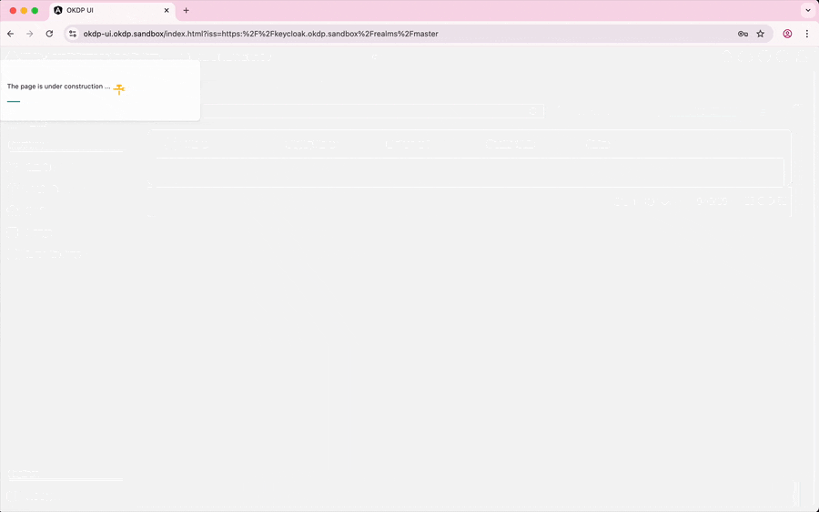

[](https://github.com/okdp/okdp-sandbox/actions/workflows/ci.yml)
[](https://github.com/OKDP/okdp-ui/releases/latest)
[](https://github.com/kubocd/kubocd)
[](http://www.apache.org/licenses/LICENSE-2.0)
<a href="https://okdp.io">
  
</a>




The OKDP Web UI provides a unified UI to deploy, configure, and monitor [OKDP Platform](https://okdp.io) components.
It simplifies operational management by providing unified control over all OKDP services deployed across multiple clusters.

***Features:***
- **Authentication** – Secure user access and session management.  
- **Multi-cluster support** – Manage and monitor multiple OKDP clusters from a single UI.
- **Deployment management** – Deploy and manage OKDP services directly from the UI, using either **GitOps** or **direct Kubernetes** deployment modes:
  - **GitOps support** – Push manifests to Git repositories to trigger automated deployments through a GitOps workflow, ensuring versioned and auditable configuration management.  
  - **Direct Kubernetes deployment** – Apply and deploy OKDP components directly to connected Kubernetes clusters from the UI for immediate changes.  
- **Configuration management** – Modify and apply configuration values across environments in both deployment modes.


# Test the Web UI

The easiest way to start testing the **OKDP UI** is by using the [okdp sandbox](https://github.com/OKDP/okdp-sandbox):

The sandbox provides a local, preconfigured OKDP environment — including the necessary backend services, dependencies, and sample data — so you can quickly validate and interact with the UI without setting up the entire platform manually.


# Developing

This project is configured with a **Dev Container** for a consistent development environment.  

## Before commit:

Make sure your code passes lint checks before committing:

```sh
yarn lint --fix
```

## Run locally:

To start the development server on 127.0.0.1:4200:

```sh
ng serve --port=4200 --host=127.0.0.1
```

## Run with Docker Compose

Build and start the UI locally via Docker:

```sh
docker-compose up --build
```

## Deploy with Helm

```sh
helm upgrade --install okdp-ui \
     --namespace okdp-ui \
     --create-namespace helm/okdp-ui \
     --values helm/okdp-ui/values.keycloak.yaml
```

# Versioning

1. Edit [package.json](./package.json) and set the new version(s):

```json
{
  "name": "okdp-ui",
  "version": "0.3.0",
  "helmVersion": "0.3.0",
}
```

2. Apply the Version(s):

```sh
npm run setversion
```
